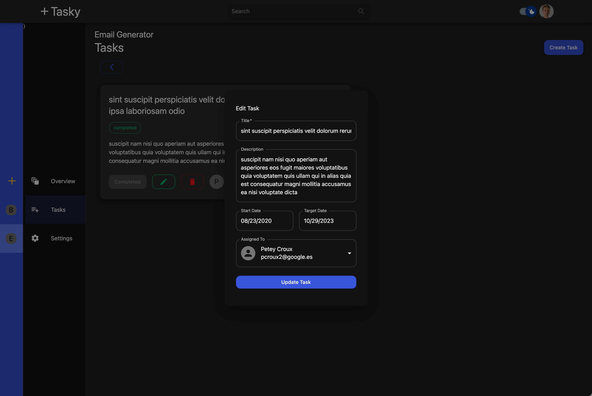
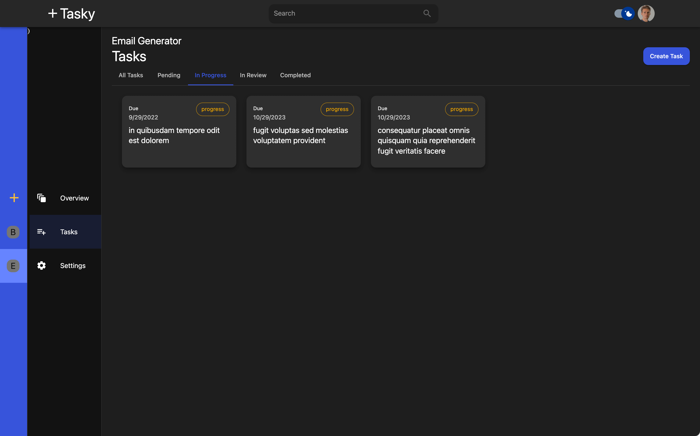
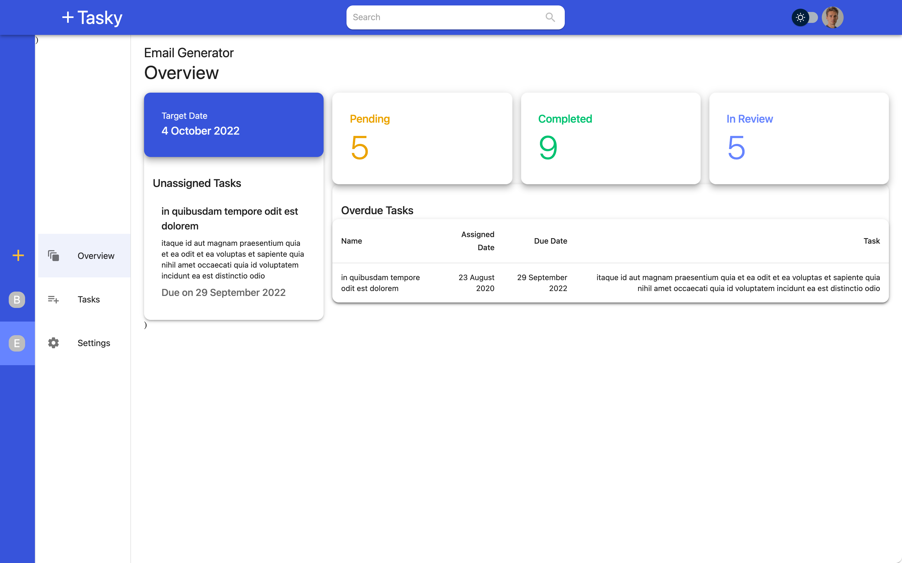
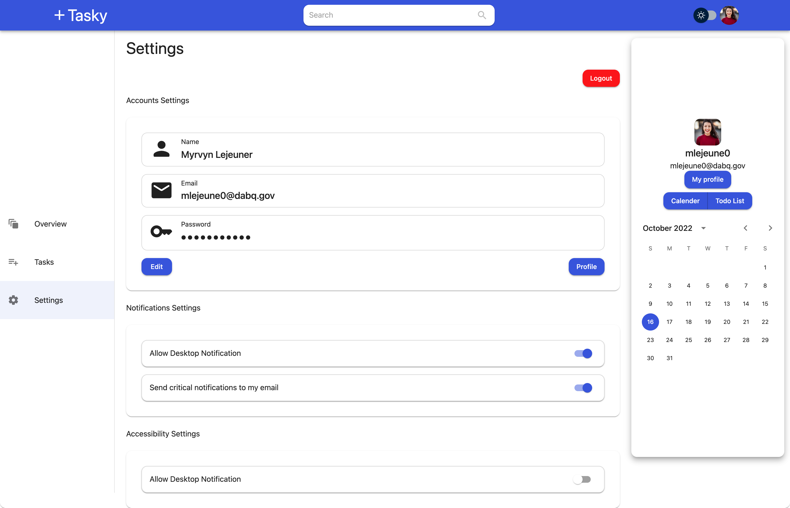
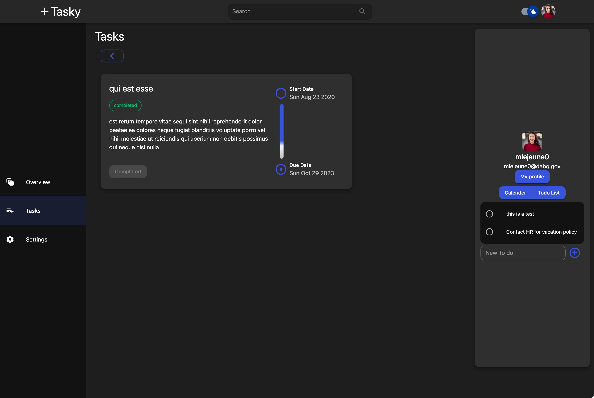
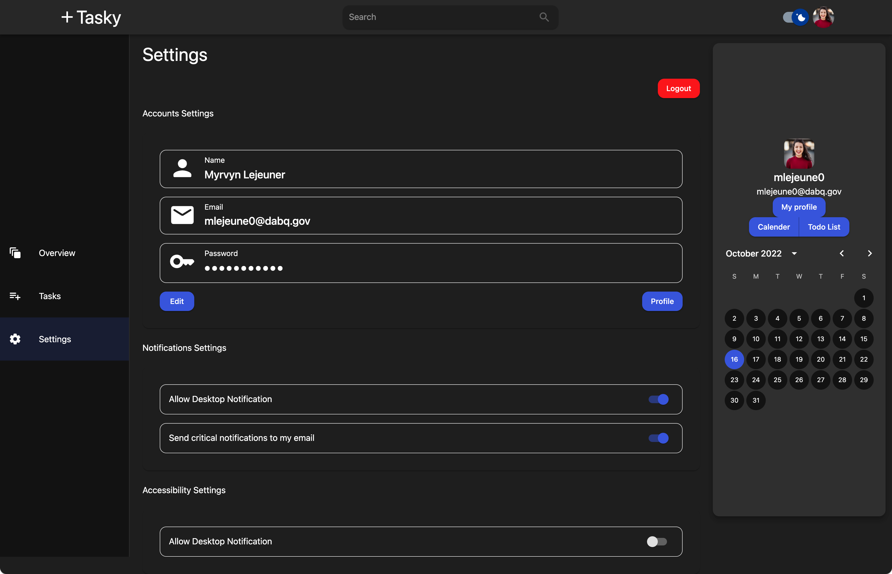
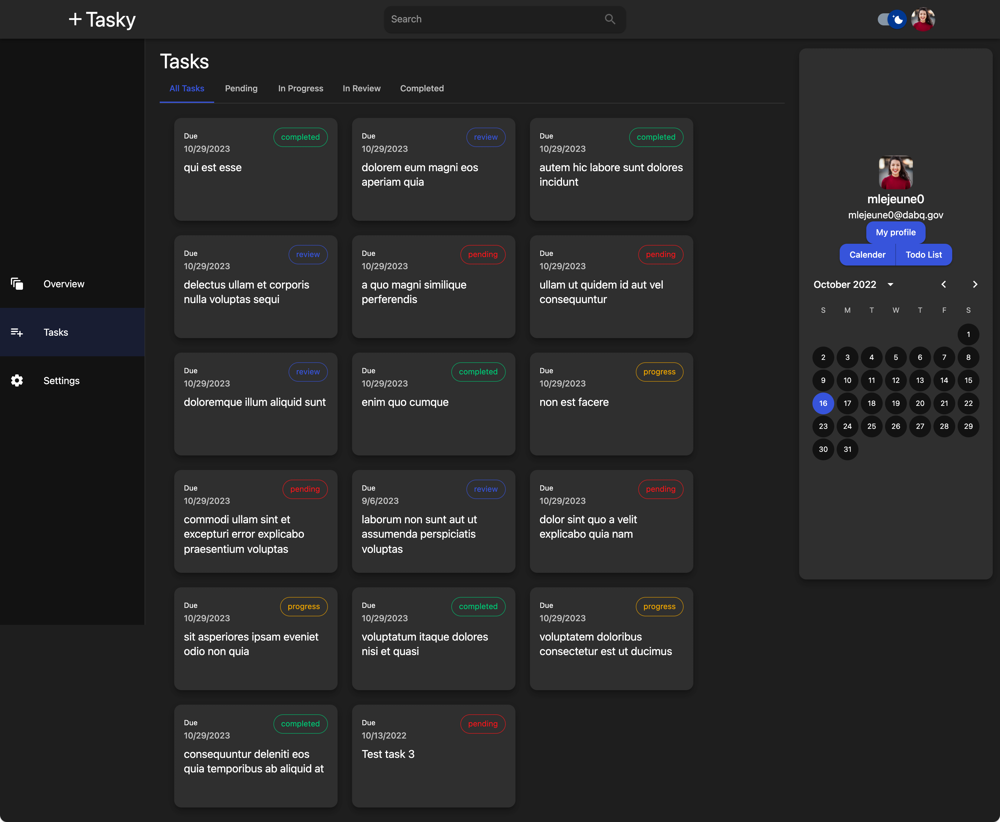
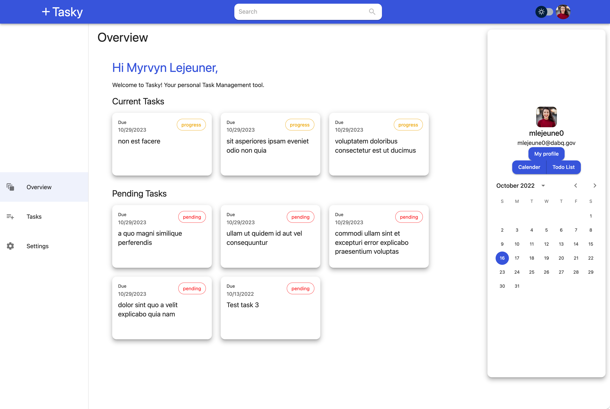
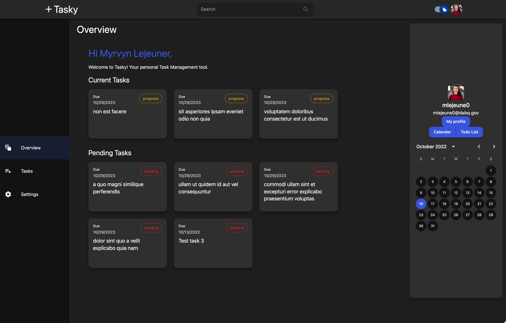

# InStock

## Demo link:
Access my site at [website](https://angrajlatake-sudoku.netlify.app/)

## Table of Content:

- [About The App](#about-the-app)
- [Screenshots](#screenshots)
- [Technologies](#technologies)
- [Setup](#setup)
- [License](#license)

## About The App
Tasky is cloud-based platform that allows users to to track issues and manage project for desktop. 

## Screenshots

## Technologies
  

  
  

## Setup
- download or clone the repository
- run `npm install`
- run `npm start`

## Features in next version
-Chat Microservice 

## License

MIT license @ [author](author.com)
